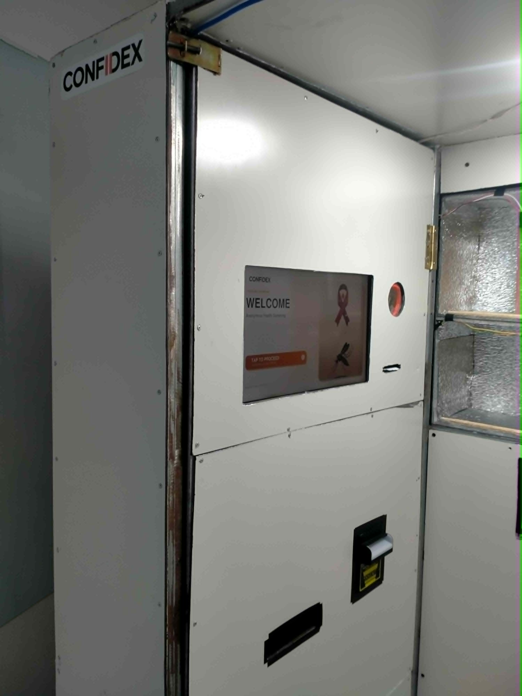
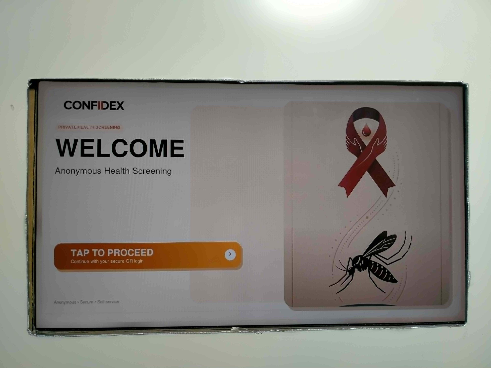
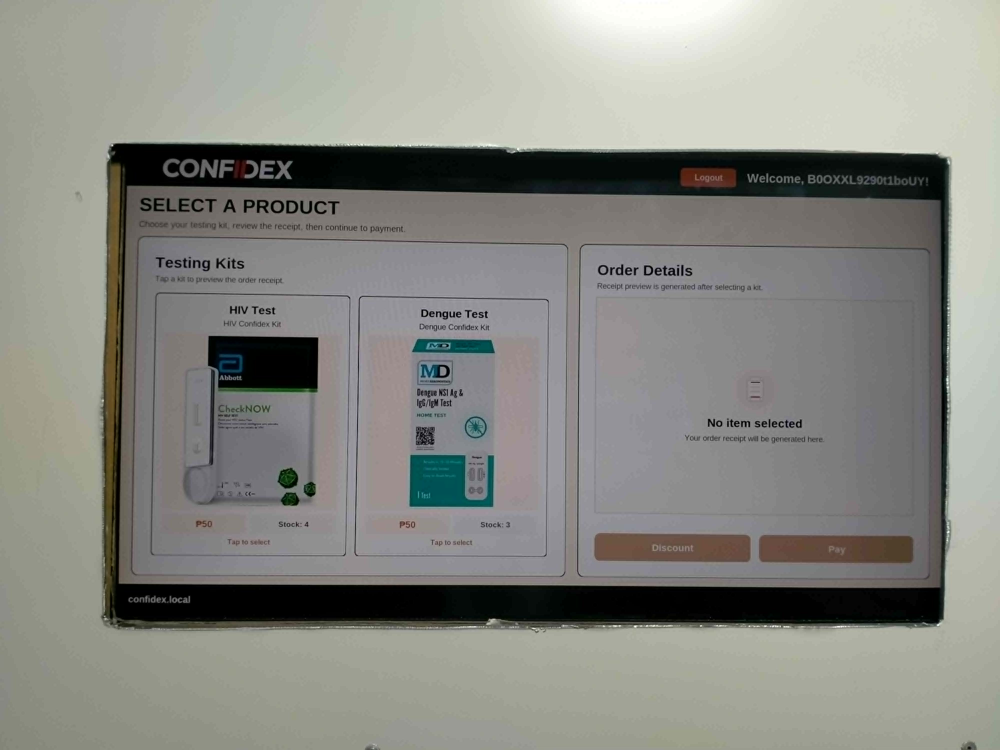

# CONFIDEX Booth GUI

CONFIDEX is a capstone project developed as a vending-based, self-service system for anonymous health screening. This repository contains the booth-side graphical user interface and local control software used by the physical CONFIDEX kiosk.

The booth application runs on a Raspberry Pi and manages the on-site user flow: QR login, product selection, cash or online payment, kit dispensing, receipt printing, tutorial display, kit insertion, camera capture, image-processing preparation, result handling, local storage, and synchronization with the CONFIDEX Web Platform.

## System Overview

The CONFIDEX Booth GUI is the physical kiosk application of the system. It provides a fullscreen touchscreen-style interface that guides users through the anonymous screening process from login to kit submission.

A typical booth session starts when the user scans a QR code generated from the website. The booth validates the login, allows the user to choose a screening kit, processes the selected payment method, dispenses the kit, prints the receipt or QR coupon when needed, shows the correct instructions for the selected kit, and waits for the used kit to be inserted. After the waiting period, the booth captures the kit image, processes the result, stores the record locally, and synchronizes the data with the web platform.

The booth was designed to continue operating even when internet connectivity is unstable. Critical records such as cash transactions, local flow states, pending uploads, offline login attempts, receipts, and result images can be preserved locally and uploaded once the system reconnects.

## Main Features

### Kiosk User Flow

- Fullscreen welcome and QR login pages.
- QR-based user login using the website-generated code.
- Product selection for HIV and Dengue screening kits.
- Payment method selection for cash or online payment.
- Cash payment handling through bill acceptor pulses.
- Change dispensing using coin servo control.
- Kit dispensing through Arduino-controlled actuators.
- Receipt and discount QR printing through a thermal printer.
- Kit-specific tutorial display with instructional videos.
- Kit insertion workflow with camera preview.
- Queue-based result capture after the configured waiting time.

### Hardware Control Features

- Raspberry Pi-based kiosk control.
- Arduino serial communication for dispensing and hardware actions.
- Linear actuator control for kit dispensing lanes.
- Coin servo control for change dispensing.
- Bill acceptor control for cash payment.
- Thermal printer support for receipt and QR printing.
- Camera capture for submitted test kits.
- Reverse vending or disposal module support for used kit handling.
- System event and visible error reporting for booth issues.

### Offline and Recovery Features

- Offline QR login support using cached identity data.
- Local storage for cash transactions when internet is unavailable.
- Pending upload storage for receipts, result images, and transaction data.
- Payment recovery support for incomplete payment flows.
- Active flow recovery so the booth can resume important interrupted sessions.
- Inventory synchronization when the connection returns.
- Error overlay and system warnings for visible booth-side issue reporting.

### Image Processing Support

- Camera capture workflow for inserted test kits.
- Local queue worker for delayed result processing.
- Support for original and annotated result images.
- Integration point for the CONFIDEX image-processing pipeline.
- Result normalization for valid, invalid, positive, and negative outcomes.
- Admin-review support for uncertain or invalid results.

## Technologies and Tools Used

### Main Application

- **Python** — Main programming language used for the booth application.
- **Tkinter / CustomTkinter** — GUI framework used for the fullscreen kiosk interface.
- **FastAPI** — Local booth API used by booth-side services.
- **Uvicorn** — ASGI server used to run the local FastAPI service.
- **SQLite** — Local persistence for queue records, pending uploads, logs, flow state, and recovery data.
- **JSON configuration files** — Used for booth branding, products, payment settings, and inventory values.
- **Threading and background workers** — Used for synchronization, queue processing, capture handling, and non-blocking hardware operations.

### Hardware and Device Communication

- **Raspberry Pi 5** — Main kiosk computer for the booth.
- **Arduino** — Microcontroller used for hardware control.
- **PySerial** — Serial communication between the Raspberry Pi and Arduino.
- **GPIO libraries** — Raspberry Pi GPIO access for hardware-related signals.
- **Thermal printer support** — Receipt and QR printing through serial-connected thermal printer hardware.
- **Bill acceptor** — Cash input detection through pulse-based bill recognition.
- **Servo motors** — Coin dispensing for change output.
- **Linear actuators** — Physical kit dispensing mechanism.
- **Camera module / V4L2 / Picamera2 support** — Image capture for rapid test kit processing.

### Image Processing and Machine Learning

- **OpenCV** — Image capture, preprocessing, and computer vision operations.
- **NumPy** — Image and array processing.
- **Pillow** — Image handling and conversion.
- **PyTorch / TorchVision** — Model support for image-processing experiments and classifiers.
- **Ultralytics YOLO** — Object detection support used for rapid test kit and strip detection experiments.
- **TensorFlow Lite / AI Edge LiteRT** — Lightweight inference support for Raspberry Pi deployment.

### Networking and Synchronization

- **Requests** — HTTP communication with the CONFIDEX Web Platform.
- **WebSocket client support** — Real-time booth communication and presence updates.
- **python-dotenv** — Local configuration loading for development and deployment.
- **Background sync workers** — Used for offline cash transaction sync, result upload sync, image upload sync, and inventory updates.

### Media and Interface Assets

- **MP4 tutorial videos** — HIV and Dengue kit instruction videos shown during the booth flow.
- **PNG image assets** — Product images, payment icons, logos, and kiosk branding.
- **Custom UI components** — Reusable rounded cards, keyboard input, loading screens, and error dialogs.

## Project Structure

```text
Confidex_Booth_GUI/
├── assets/              # Logos, product images, payment icons, and tutorial videos
├── backend/             # Booth services, sync logic, printing, activity tracking, and recovery modules
├── backend/util/        # API client, camera capture, serial communication, and kit queue worker
├── config/              # Local booth configuration and inventory files
├── data/                # Local runtime data, pending uploads, and offline records
├── frontend/            # Theme, widgets, compatibility helpers, and reusable UI components
├── pages/               # Kiosk pages for QR login, payment, dispensing, tutorial, and kit insertion
├── config_manager.py    # Local configuration and inventory manager
├── main.py              # Main application entry point
├── requirements.txt     # Python dependencies
└── run_confidex.sh      # Convenience script for running the booth application
```

## Getting Started

Create and activate a Python virtual environment:

```bash
python3 -m venv venv
source venv/bin/activate
```

Install the required dependencies:

```bash
pip install -r requirements.txt
```

Run the booth application:

```bash
python3 main.py
```

Or run it using the provided shell script:

```bash
./run_confidex.sh
```

The booth requires local configuration for the connected website, booth identity, Arduino serial port, printer serial port, camera, payment hardware, and inventory settings. Keep all credentials and private values out of the repository.

## Relationship With the Web Platform

The CONFIDEX Booth GUI is the physical kiosk companion of the CONFIDEX Web Platform. The booth depends on the website for QR login, payment status, transaction records, inventory updates, receipt records, result uploads, and administrator review.

When the booth is online, it synchronizes transactions, receipts, inventory, and result images with the website. When the booth is offline or the connection is unstable, it saves important records locally and uploads them later once the connection is restored.

## Capstone Project Members

1. **Christian Angelo Palebino** — Lead Software Engineer / Lead System Architect  
   Led full-stack development, system architecture, database design, image-processing decisions, and software integration across the booth and web platforms.

2. **Kimberly Shane B. Belledo** — Lead Researcher / Project Manager  
   Led project coordination, procurement planning, budget tracking, material management, and overall system integration.

3. **Micaella Erlyne Chelsen R. Compañero** — Technical Researcher / Compliance Officer  
   Handled technical documentation, research direction, compliance review, system limitations, and best-practice alignment.

4. **Mark Clein S. Toriano** — Frontend Developer / Mechanical and Structural Designer  
   Worked on frontend presentation and the physical booth structure, layout, 3D design, usability, accessibility, and component placement.

## Notes

CONFIDEX is a capstone prototype intended to support anonymous preliminary health screening. Results produced by the system should be treated as screening outputs only and should still be followed by proper medical consultation, confirmatory testing, and professional guidance.




